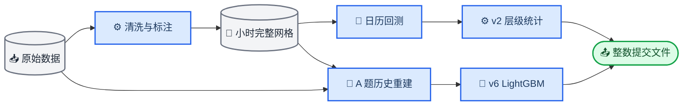

# CTS Forecasting

*CTS 2026 港口拖轮 AIS 预测项目，同时完成活跃拖轮数量预测与圈层迁移量预测。*

---

## 📌 项目概览

项目使用 2018 年 1 月 1 日至 24 日的拖轮 AIS 轨迹，预测 1 月 25 日至 31 日每小时的两个目标。港区以 `(117.79°E, 38.97°N)` 为中心，划分为核心区（0–3 km）、近港区（3–10 km）和外围区（10–30 km）。

| 任务 | 官方口径 | 提交规模 |
| --- | --- | ---: |
| A：活跃拖轮数量 | 同一船、同一小时、同一圈层内，`2 <= SOG <= 10` 的 AIS 记录不少于 3 条；一艘船可在多个圈层分别计数 | 168 小时 × 3 圈层 = 504 行 |
| B：圈层迁移量 | 每船每小时取 AIS 点数最多的代表圈层；并列时取最后出现时间更晚的圈层；相邻小时代表圈层不同则计一次迁移 | 168 小时 × 6 方向 = 1008 行 |

B 题不使用 A 题的 SOG 和最少记录数筛选。提交系统只接受非负整数预测，生成脚本会校验完整网格并输出整数列。

## 🚀 快速开始

项目约定使用本地 Conda 环境 `CTS2026`，需要 Python 3.10 或更高版本。

将以下四个官方文件放入 `data/raw/`：

- `训练集_20180101-0124_拖轮AIS.csv`
- `验证集_20180125-0131_每日拖轮数量.csv`
- `提交结果1_区域活跃拖轮数量.csv`
- `提交结果2_圈层间拖轮迁移量.csv`

```powershell
conda activate CTS2026
python -m pip install -e ".[dev]"
python scripts/preprocess.py
python scripts/train_v2.py
python -m pytest -q
```

当前线上最优的 v2 结果位于：

- `data/submission/task_a_submission.csv`
- `data/submission/task_b_submission.csv`

## 🏗️ 数据与建模流程



预处理会生成完整的零值小时网格，而不是只保留非零标签：A 题 1728 行，B 题 3456 行。训练质量控制按任务分开：

| 任务/版本 | 处理区间 | 处理方式 |
| --- | --- | --- |
| A：v2 | 1 月 13 日至 18 日 | 原始版本排除主断档标签 |
| A：v4–v5 | 1 月 12 日至 18 日 | 扩大范围，保守排除低覆盖标签 |
| A：v6 | 1 月 12 日 07:00 至 1 月 19 日 09:00 | 用辅助 AIS 源校准重建；不使用硬性日总量约束 |
| B | 1 月 13 日至 18 日 | 主数据源断档会影响代表圈层和迁移标签 |
| B | 1 月 24 日 23:00 | 原始数据止于当日 23:59，无法观察到下一小时，标签右删失 |

## 📊 当前模型与回测

### 线上结果

评价指标为 `SSE_A + 3 × SSE_B`，分数越低越好。当前已知线上结果如下：

| 版本 | 方法 | A题 SSE | B题 SSE（×3） | 总分 |
| --- | --- | ---: | ---: | ---: |
| **v2** | 日总量与小时比例 | **4738** | **890（2670）** | **7408** |
| v4 | 分任务整数统计融合 | 4806 | 1096（3288） | 8094 |
| v6 weighted labels | 重建历史与低权重伪标签 | 5140 | 1066（3198） | 8338 |
| v6 feature only | 重建值仅作历史特征 | 5224 | 1066（3198） | 8422 |
| v5 LightGBM | 纯小时级树模型 | 5472 | 1051（3153） | 8625 |
| v5 Random Forest | 纯小时级树模型 | 6020 | 1164（3492） | 9512 |

v2 仍是当前线上最优。v6 相比 v5 LightGBM 有改进，但尚未超过 v4 和 v2；两组 v6 的 B 题完全相同，线上差异全部来自 A 题。

### v6 重建历史实验

v6 使用按天递归的 LightGBM：一次预测目标日 24 小时，再把当天浮点预测加入历史，继续预测下一天。A 题有两组对照：

| 变体 | 重建值用于历史特征 | 重建值作为训练标签 | 伪标签权重 |
| --- | :---: | :---: | ---: |
| `feature_only` | 是 | 否 | — |
| `weighted_labels` | 是 | 是 | 置信度调整，最大 0.35 |

辅助源重建在健康日期逐日留一回测中的小时 RMSE 为 2.030，优于星期/小时均值的 3.333。硬性日总量约束会把 RMSE 提高到 2.097，因此没有用于最终重建。

复现 v6：

```powershell
python scripts/reconstruct_task_a_gap.py
python scripts/evaluate_task_a_reconstruction.py
python scripts/train_PureML_reconstructed_v6.py
```

生成结果位于 `data/submission/PureML_v6/reconstructed/` 下的 `feature_only/` 和 `weighted_labels/` 目录。

### 本地日历回测

v4 为 A/B 独立的整数统计融合：

| 任务 | 全历史分组均值 | 近期同小时均值 |
| --- | ---: | ---: |
| A | 30% | 最近 14 个有效日，70% |
| B | 70% | 最近 10 个有效日，30% |

统一回测使用 5 个可用的连续 3 日窗口，起点为 1 月 8、9、19、20、21 日；评价指标为 `SSE_A + 3 × SSE_B`。下表是每折平均值：

| 策略 | 加权 SSE | A SSE | B SSE | A MAE | B MAE |
| --- | ---: | ---: | ---: | ---: | ---: |
| v4 任务独立整数融合 | 3153.20 | 2004.80 | 382.80 | 2.322 | 0.532 |
| v3 校准统计基线 | 3378.80 | 2120.00 | 419.60 | 2.344 | 0.560 |
| 最近 10 个有效日同小时均值 | 3433.60 | 2149.00 | 428.20 | 2.375 | 0.568 |
| v2 日总量与小时比例 | 3453.00 | 2141.40 | 437.20 | 2.345 | 0.569 |

这些数字只代表本地日历回测，不等于线上成绩。本地回测将 v4 排在 v2 之前，但线上顺序相反，因此有限日期上的回测只用于筛选，不能代替线上验证。

运行完整比较与权重搜索：

```powershell
python scripts/evaluate.py
python scripts/search_ensemble.py
```

## 🗂️ 关键文件

| 路径 | 作用 |
| --- | --- |
| `configs/settings.yaml` | 港区中心、圈层半径、活跃阈值和日期范围 |
| `scripts/preprocess.py` | 清洗、A/B 标签构建、完整网格与时序特征 |
| `scripts/evaluate.py` | 统一的日历感知加权 SSE 回测 |
| `scripts/search_ensemble.py` | 分别搜索 A、B 的整数融合权重 |
| `scripts/train_v2.py` | 生成当前线上最优的层级统计提交 |
| `scripts/train_v4.py` | 生成 A/B 独立的统计融合提交 |
| `scripts/reconstruct_task_a_gap.py` | 生成 A 题重建历史、置信度和样本权重 |
| `scripts/evaluate_task_a_reconstruction.py` | 逐日留一评估 A 题重建方法 |
| `scripts/train_PureML_reconstructed_v6.py` | 生成两组 PureML v6 对照提交 |
| `src/features/zone.py` | A 多圈层计数与 B 代表圈层语义 |
| `src/data/task_a_reconstruction.py` | 辅助 AIS 源特征、校准模型与伪标签重建 |
| `src/features/ml.py` | 因果滞后、每日批量和独立历史值特征 |
| `src/models/tree.py` | LightGBM/RF、样本权重和按天递归预测 |
| `src/evaluation.py` | 回测折、预测器和评价指标实现 |
| `src/models/` | 统计基线、校准模型与整数融合 |
| `src/submission.py` | 模板对齐、网格校验和 CSV 输出 |
| `tests/` | 任务语义、评价、校准和融合测试 |

更完整的数据结论与五步优化进度见 `docs/plan.md`，赛题原始说明见 `docs/request.md`。

## 🔧 常见问题

如果脚本提示缺少 `data/processed/*.csv`，先运行 `python scripts/preprocess.py`。v6 还要求先运行 `python scripts/reconstruct_task_a_gap.py`。如果从项目目录外无法 `import src`，重新执行 `python -m pip install -e ".[dev]"`。不要把 1 月 12 日 07:00 至 1 月 19 日 09:00 的低覆盖标签直接当作真实业务低谷。
